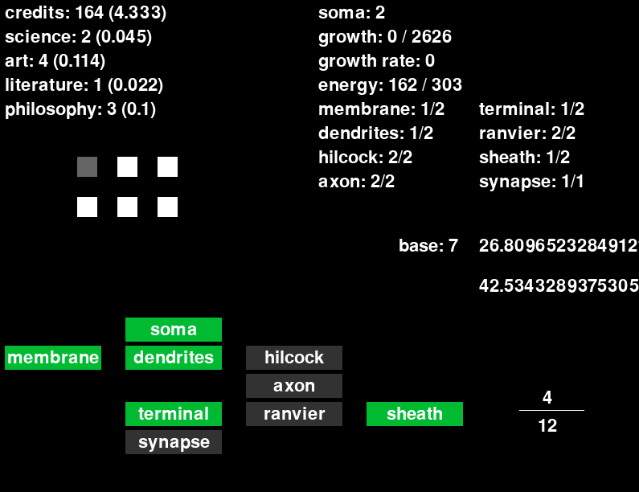

## ThinkTank

ThinkTank is a WIP idle game where you grow artificial brains and use the resources they gather to improve society.

### Gameplay

The entire game is basically one big debug mode right now, with a couple controls to go with it:

* `UP`: Increase the current base you're playing in by 1, up to a maximum of 36
* `DOWN`: Decrease the current base you're playing in by 1, down to a minimum of 2
* `B`: Add a brain to an open tank; currently a maximum of 6 are supported

Once you've added at least one brain, You can begin upgrading it. The interface is quite simple, but you should be able to get a good idea as to what's going on.

Each brain component depends on the previous one in the tree; For example the axon can only level as high as the hilcock for a particular brain. Each component has a unique impact on credit generation, resource production, and brain growth rate.

In the bottom-right corner you can see a fraction, where the top number indicates how many upgrades you've purchased, and the bottom shows how many more you need to reach the next grant level. There is no in-game notification that tells you this, you'll just have to watch your average credit rate in the top-left.

### Future plans

* Different brain types which generate some resources faster than others
* A social program system which improves resource & upgrade rates, while occasionally providing unique effects
* A variety of grant programs based on brain research, whether specific to the type of brain or type of part upgraded
* A Paradigm system which alters gameplay balance in a fundamental way
* Achievements! Achievements galore!